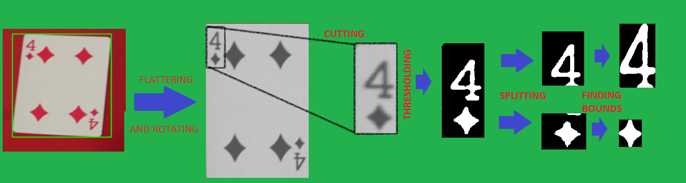
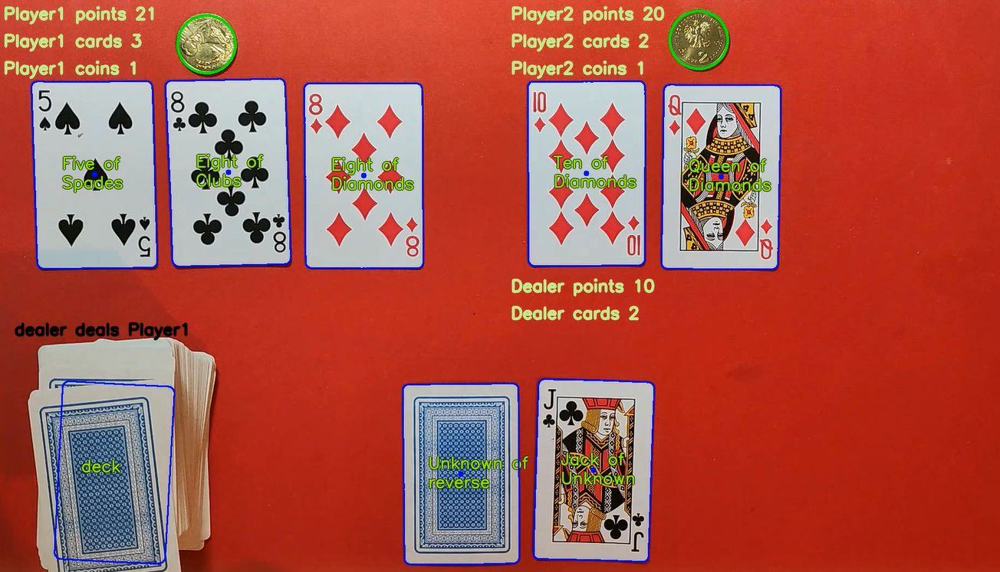
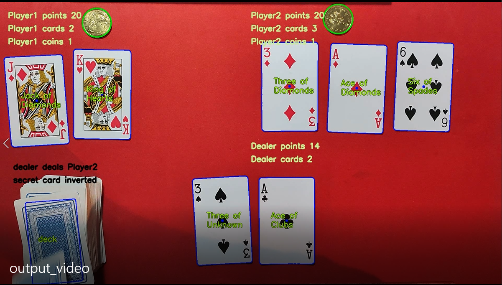
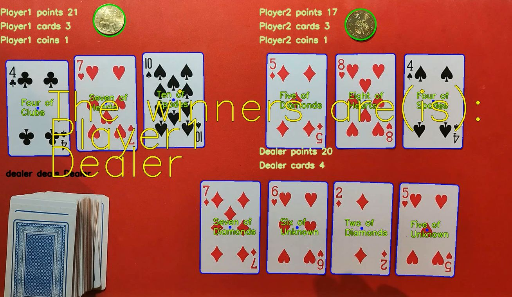

# Black Jack Card Game Detector

*Prerequisites:*
- Python 3.8

*Instalation:*

```bash
pip install -r requirements.txt
```

*Running:*
```bash
python main.py
```

# Report

We use traditional methods: openCV and friends. 
To keep our calculation short, we evaluate only every 15 frames, and draw the result on every next 15 frames. For each such game state, we keep track of cards and coins that were found previously, and if nothing is found nearby, we restore such cards/coins (with few exceptions). At the beginning we preprocess the initial frame. We searched for coins using HoughCircles, so nothing interesting. But…

Searching for cards, and finding their suits and ranks was the meat of this project. 
We begin from finding each object that has 4 sides and his size in between some bounds.


Then we reshape and rotate each such card into a certain shape and verticaly(for cards it doesn’t matter if the card is upside down). Next, in the corner of this card there is his rank and suit (these values are hardcoded and depend on cards that you are using). 

### Examples of Traing Set:
     

We compare the segment with this card rank with each rank in our “Training set” using absolute difference, and the one with the lowest is chosen as our model prediction. We repeat the same process for this card suit. 

From this point logic is straightforward: this is more or less typical BlackJack.

We detect:
- when a dealer deals someone cards,
- when dealers ‘secret card’ become reveal, 
- when player decided to double his bet
- when someone ‘busted’
- who win

# Examples:

 
 


